# Immersive Live Streaming on AWS

## Overview

Immersive video, often referred to as VR or 360-video, allows content creators to capture and deliver unique experiences. Social Media sites have implemented immersive video into their platforms, making it widely accessible to consumers, but what of builders who seek to design our own unique experiences, where do we begin?

Additionally, live streaming, a commoditized consumer product spanning far outside the realm of Social Media, still poses unique implementation challenges. One mistake can cost rightsholders revenue and, arguably worse, customer loyalty.

In this workshop, we bring these two technologies together. Demystifying live streaming, while examining the unique experience of immersive video.

### Requirements

* AWS account - if you don't have one, it's easy and free to create one.
* AWS IAM account with elevated privileges allowing you to interact with CloudFormation, IAM, EC2, S3, CloudWatch, and CloudFront.
* A workstation or laptop with an SSH client installed, such as putty on Windows or Terminal on MacOS.
* Familiarity with bash, web servers, video processing, and streaming media is strongly encouraged, but not absolutely required.

### Labs

The labs in this directory are designed to be completed in sequential order. If you're attending an AWS event, your host will give you an overview of the technology and expectations for each lab. If you're following along at home, we've provided the presentation materials as a pdf. Feel free to open issue tickets on the repo if you have questions or issues.

Please use a modern version of the Google Chrome browser as this is what we've used to design the workshop. We also recommend having a scratch pad or somewhere to keep important information throughout the lab.

**Lab 1:** Live Streaming Service

**Lab 2:** Video-on-Demand Recording

**Lab 3:** Caching and Content Delivery Networks

### Conventions

Throughout this README, we provide commands for you to run in the terminal.  These commands will look like this:

<pre>
$ ssh -i <b><i>PRIVATE_KEY.PEM</i></b> ec2-user@<b><i>primaryOriginElasticIP</i></b>
</pre>

The command starts after $.  Words that are ***UPPER_ITALIC_BOLD*** indicate a value that is unique to your environment.  For example, the ***PRIVATE\_KEY.PEM*** refers to the private key of an SSH key pair that you've created, and the camelCase ***primaryOriginElasticIP*** is a value provided found in the console, either as a CloudFormation Output or as indicated.

### Cleanup and Disclaimer

This section will appear again below as a reminder because you will be deploying infrastructure on AWS which will have an associated cost. Fortunately, this workshop should take no more than 2.5 hours to complete, and uses primarily EC2 Spot instances, so costs will be minimal (less than $5 USD). When you're done with the workshop, follow these steps to make sure everything is cleaned up.

* Delete any manually created resources throughout the labs.
* Delete any files stored on S3.
* Delete both CloudFormation stacks launched throughout the workshop.

Please note that this lab **is not** eligible for the Free Tier for EC2 due to the instance sizes necessary to process live video.

## Challenge

Imagine that you're part of the re:Invent 2017 team. There's limited session availability and not everyone can attend in person - what can you do? As the organizer, you could stream the sessions with regular old video with a fixed field-of-vision **_or_** you could raise the bar for conference streaming everywhere by streaming a truly immersive experience. Your challenge, should you choose to accept it, is to build this system by following the labs in this workshop.

 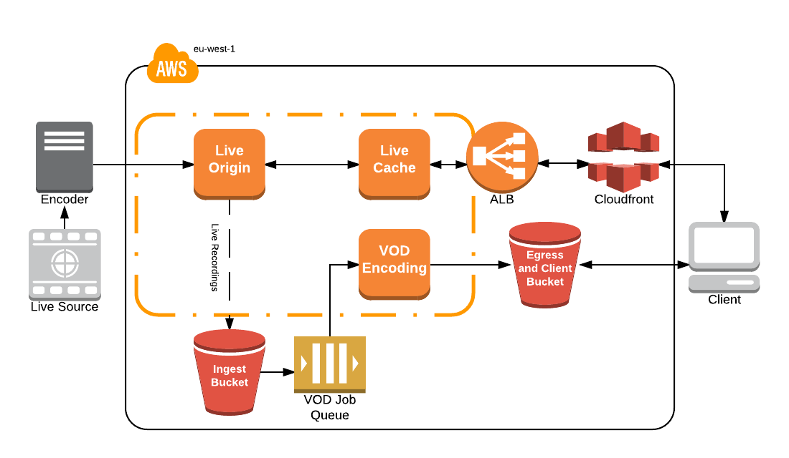

## Lab 0 - Setup

1\. First, you'll select a [region](http://docs.aws.amazon.com/AWSEC2/latest/UserGuide/using-regions-availability-zones.html). At the top right hand corner of the AWS Console, you'll see a **Support** drop down. To the left of that is the region selection drop down. For this lab, please use **EU (Ireland)**.

2\. Next, you need to create an SSH key pair which is used to login to the instances once provisioned.  Go to the EC2 Dashboard and click on **Key Pairs** in the left menu under Network & Security.  Click **Create Key Pair**, provide a name (can be anything, make it something memorable) when prompted, and click **Create**.  Once created, the private key in the form of .pem file will be automatically downloaded.

If you're using linux or mac, change the permissions of the .pem file to be less open.

<pre>$ chmod 400 <b><i>PRIVATE_KEY.PEM</i></b></pre>

If you're on windows you'll need to convert the .pem file to .ppk to work with [putty](https://www.chiark.greenend.org.uk/~sgtatham/putty/latest.html).  Here is a link to instructions for the file conversion - [Connecting to Your Linux Instance from Windows Using PuTTY](http://docs.aws.amazon.com/AWSEC2/latest/UserGuide/putty.html)

3\. We provide a CloudFormation template to help attendees get started. This template launches much of the infrastructure required, but leaves certain components for you, the participant, to implement.

_Prior to launching a stack, be aware that a few of the resources launched need to be manually deleted when the workshop is over. When finished working, please review the "Workshop Cleanup" section to learn what manual teardown is required by you._

Click on the Deploy to AWS button below to launch the required infrastructure in the Ireland (eu-west-1) region.

 [](https://console.aws.amazon.com/cloudformation/home?region=eu-west-1#/stacks/new?stackName=immersive-live-streaming-stack&templateURL=https://s3-eu-west-1.amazonaws.com/immersive-streaming-workshop/start.yaml)

The template will automatically bring you to the CloudFormation Dashboard and start the stack creation wizard. Click "Next". Do not change anything on the first screen.

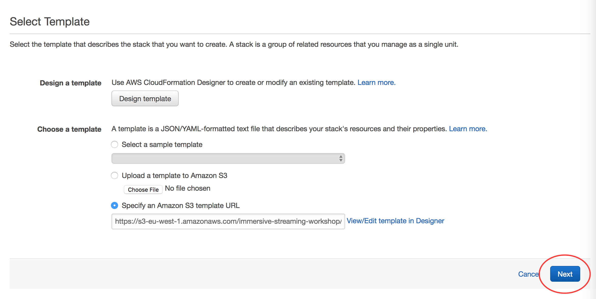

The template sets up a VPC, IAM roles, S3 bucket, SQS, ALB, and EC2 Instances running various components of the solution - origin, cache, and transcode.  The idea is to provide a contained environment, so as not to interfere with any other provisioned resources in your account.  In order to demonstrate cost optimization strategies, the EC2 Instances are [EC2 Spot Instances](https://aws.amazon.com/ec2/spot/) deployed by [Spot Fleet](http://docs.aws.amazon.com/AWSEC2/latest/UserGuide/spot-fleet.html).  If you are new to [CloudFormation](https://aws.amazon.com/CloudFormation/), take the opportunity to review the [template](https://github.com/awslabs/immersive-media-refarch/blob/master/workshop/start.yaml) during stack creation.

**IMPORTANT**
*On the parameter selection page of launching your CloudFormation stack, make sure to choose the key pair that you created in step 1. If you don't see a key pair to select, check your region and try again.*

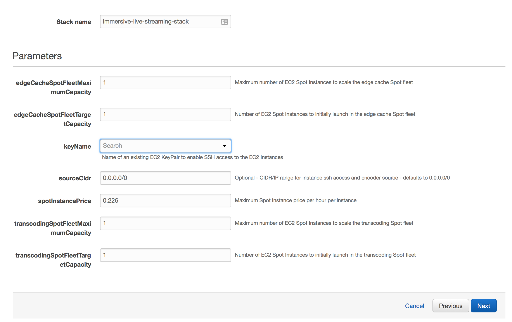

**Create the stack**
After you've selected your ssh key pair, click **Next**. On the **Options** page, accept all defaults- you don't need to make any changes. Click **Next**. On the **Review** page, under **Capabilities** check the box next to **"I acknowledge that AWS CloudFormation might create IAM resources."** and click **Create**. Your CloudFormation stack is now being created.

**Checkpoint**
Periodically check on the stack creation process in the CloudFormation Dashboard.  Your stack should show status **CREATE\_COMPLETE** in roughly 5-10 minutes.  In the Outputs tab, take note of the **primaryOriginElasticIp** and **clientWebsiteUrl** values; you will need these in the following labs.

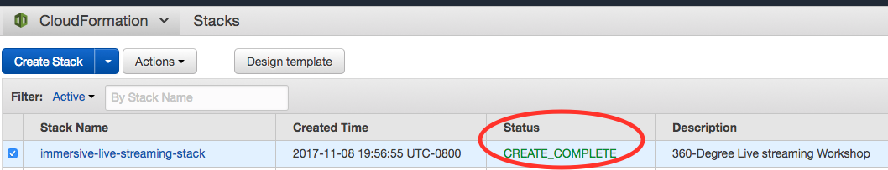

When your stack moves to a **CREATE\_COMPLETE** status, you won't necessarily see EC2 instances yet. If you don't, go to the EC2 console and click on **Spot Requests**. There you will see the pending or fulfilled spot requests. Once they are fulfilled, you will see your EC2 instances within the EC2 console.

If an error occurs during stack creation, CloudFormation will rollback and terminate.  You can investigate and troubleshoot by looking in the Events tab. Errors encountered during stack creation will appear in the event log. 

## Lab 1 - Live Streaming Service

In this lab, you will live stream to the origin and confirm that it plays back with a test client. But, first, a word on transmitting live video...

In the real-world, content is captured in real-time via a camera, compressed, and sent to a central location for further processing and distribution. Broadcasting from a remote production location to distribution infrastructure is called *Contribution* and it requires careful consideration of the network characteristics between these two geographic points.

* Does the remote location have dedicated bandwidth, public internet connectivity, cellular or nothing at all?
* Which protocols are supported by on-premise equipment and the origin? Which provides the best tolerance for network anomalies?
* Do we require redundant contribution streams over multiple network paths?
* What data rate is required to create a quality end-user experience?
* Do users have latency expectations?

In a development environment, you can avoid most of these questions by using a local test signal to simulate a live stream. FFmpeg has been built into the origin and you'll use it to generate the live signal. But, don't forget to connect other devices if bandwidth is available. 

**IMPORTANT**
_Mobile phones will not warn you when streaming over cellular networks and can quickly eat up capped data plans. AWS **_IS NOT_** liable for data charges incurred as a part of this workshop._

With that said, here's what we'll be building in this lab. Let's get started.

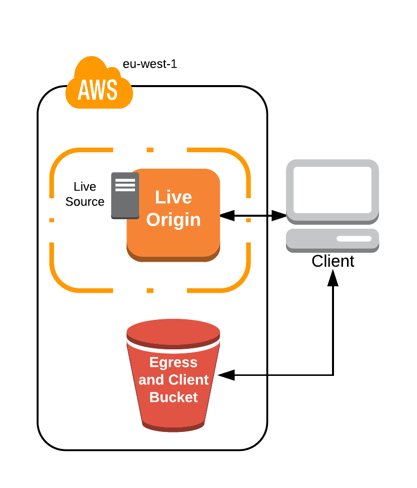

1\. From the CloudFormation console, select the stack you created, then Outputs. Find _**primaryOriginElasticIp**_ and note the value. This is the IP address of your media origin.

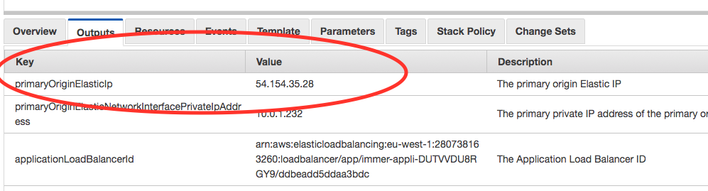

2\. SSH into the origin instance with the following command:

<pre>$ ssh -i <b><i>PRIVATE_KEY.PEM</i></b> ec2-user@<b><i>primaryOriginElasticIp</b></i></pre>

3\. Next, start ffmpeg to simulate a live signal. The following command uses lavfi/libavfilter with ffmpeg to generate a test pattern. A full description of each flag can be found in the appendix.

_Use of a terminal multiplexer like screen or tmux is advised to open multiple shells over a single SSH session._

<pre>
$ ffmpeg -stats -re -f lavfi -i aevalsrc="sin(400*2*PI*t)" -f lavfi -i testsrc=size=1280x720:rate=30 -vcodec libx264 -b:v 500k -c:a aac -b:a 64k -vf "format=yuv420p" -x264opts keyint=60:min-keyint=60:scenecut=-1 -f flv 'rtmp://localhost/live/test'
</pre>

4\. With the test stream running and connected to the origin, new [Apple HLS](https://developer.apple.com/streaming/) transport stream segments are generated and old segments cleaned-up by the nginx-rtmp module. Confirm that this is the case by listing the directory contents periodically or _watch_-ing the segment manifest file.

<pre>$ sudo watch -n 0.5 cat /var/lib/nginx/hls/test_1280/index.m3u8</pre>

5\. Now for the exciting part - _playing the live stream_. Within the CloudFormation console, find the Output listed as _**clientTestPatternUrl**_. This is a static website, built with [A-Frame](https://aframe.io/) and [HLS.js](https://github.com/video-dev/hls.js/), hosted in an S3 bucket. Click the link to open it in a new browser tab. 

Note that the includes a value for the _url_ query string parameter at the end, this is the stream location and can be updated to use any publicly accessible HLS stream. The CloudFormation output _**clientTestPatternUrl**_ combines the _**primaryOriginElasticIp**_ with the nginx-rtmp application (hls) and stream name (test) presenting you with a stream directly from the origin.

You should now see spherical colorbars and hear a test tone from the system. Success! If you want to mute the test tone, right-click the Chrome browser tab and select 'Mute Tab'


## Lab 2 - Video on Demand

What about participants who aren't able to attend during the scheduled session? You should create a Video-on-Demand recording that allows anyone to virtually attend when they chose. In this lab, use the nginx-rtmp _record_ directive to capture the live source, then transcode it with a fleet of EC2 instances. With the VOD transcode fleet, jobs can run much slower than real-time, emphasizing quality over real-time delivery. Additionally, if we want to create additional ABR renditions or apply alternate projection mapping filters, you can do so with the VOD transcode fleet.

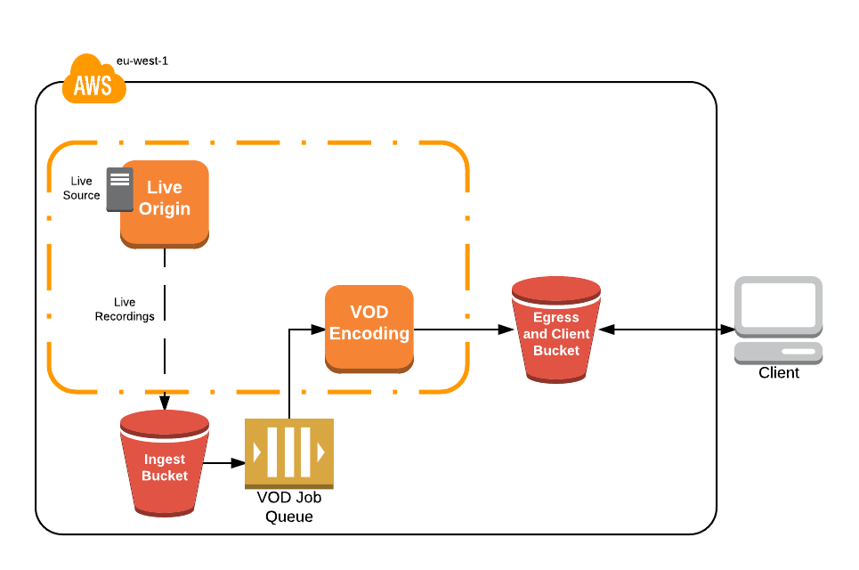

### Config Changes

1\. SSH into the Origin

<pre>$ ssh -i <b><i>PRIVATE_KEY.PEM</i></b> ec2-user@<b><i>primaryOriginElasticIp</b></i></pre>

2\. Modify the nginx configuration to include the record directive. This records all audio/video streams to /var/lib/nginx/rec, rolls over the file if the size reaches 128M or the source stream stops. Upon recording creation, nginx executes a script to upload the asset into S3. A full listing and description of the nginx-rtmp directives, variables, and other components can be found [here](https://github.com/arut/nginx-rtmp-module/wiki/Directives).

To modify the configuration file, use nano or vim. To navigate with nano, use arrow keys. When complete hit CTRL+X, Y (yes to save), then ENTER to confirm the filename.

<pre>$ sudo nano /etc/nginx/rtmp.d/rtmp.conf</pre>

_Configuration file after Changes_

Full configuration file with record directives can be found [here](complete/origin/nginx/rtmp.d/rtmp.conf)

```
   application live {
      # FOR LAB, INSERT RECORDING CONFIGURATION BELOW THIS COMMENT
      record all;
      record_path /var/lib/nginx/rec;
      record_max_size 128000K;
      exec_record_done /usr/local/bin/record-postprocess.sh $path $basename;
      exec /usr/local/bin/ffmpeg -i rtmp://localhost/$app/$name -async 1 -vsync -1 -c:v copy -c:a aac -b:a 96k -f flv rtmp://localhost/show/$name_1280;
   }
```

3\. Restart nginx for the changes to take effect.

<pre>$ sudo service nginx restart</pre>

### Testing Video-on-Demand

Recording begins when a stream is published to the nginx application. Upon stream stop, nginx-rtmp finishes the recording and executes a script to upload into **_s3IngressBucket_**. New objects in this bucket generate an event, which is published to _**transcodingQueue**_. _**transcodingSpotFleet**_ periodically polls this queue and transcodes the recordings and resulting ABR outputs are uploaded into **_s3EgressBucket_**, the same bucket hosting our client page.

With the configuration updates in place, you can now test the full system functionality. There's a few components to the VOD system, so you'll want to examine each one to validate proper execution.

1\. FFmpeg will have stopped upon origin restart, so SSH into the origin and start the ffmpeg test stream. Let it run for ~30 seconds, then stop it by pressing CTR+C

<pre>
$ ffmpeg -stats -re -f lavfi -i aevalsrc="sin(400*2*PI*t)" -f lavfi -i testsrc=size=1280x720:rate=30 -vcodec libx264 -b:v 500k -c:a aac -b:a 64k -vf "format=yuv420p" -x264opts keyint=60:min-keyint=60:scenecut=-1 -f flv 'rtmp://localhost/live/test'
</pre>

Simple Queue Service (SQS) decouples the transcode requests from the transcode fleet. It carries the S3 bucket events, generated when a new recording is put into **_s3IngressBucket_**, and serves as a job queue for the _**transcodingSpotFleet**_. In the event that an instance fails or is terminated by EC2 Spot, events will return to the queue and be processed by another node. This system also uses the queue depth to autoscale _**transcodingSpotFleet**_ based on number of recordings waiting to be processed, though it has been set to 1 to minimize workshop costs.

The transcode worker is running a polling script every 5 seconds to pull down any new job from SQS. By now, it should be processing a job. We can confirm this by looking at the CPU utilization, viewing the notification in the CloudWatch Log Stream, or by simply waiting for the output to appear in the S3 bucket _**transcodingEgressBucketId**_.

5\. In the EC2 console, search for 'transcoding', this will filter for the EC2 instance we have deployed that has the _transcodingSecurityGroup_ attached. Select the resulting instance and, at the bottom of the console, select the _Monitoring_ tab. Here, we should see a sharp incline in the CPU utilization while the instance is processing.

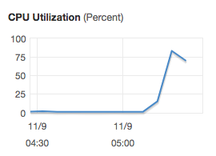

6\. When the CPU metric goes down, our VOD transcode is complete. Navigate to the S3 console and search/select the bucket containing _**transcodingEgress**_. Here, you should see a key starting with test-_TIMESTAMP/_, this was the output directory of the transcode job and is now the object prefix within S3. Within, there should be many transport stream (.ts) and manifest (.m3u8) objects. Select the MANIFEST.m3u8 and note the link, this is our playback URL for the video-on-demand recording, now transcoded for adaptive bitrate delivery.

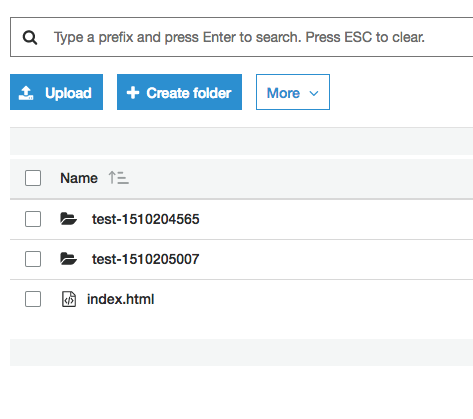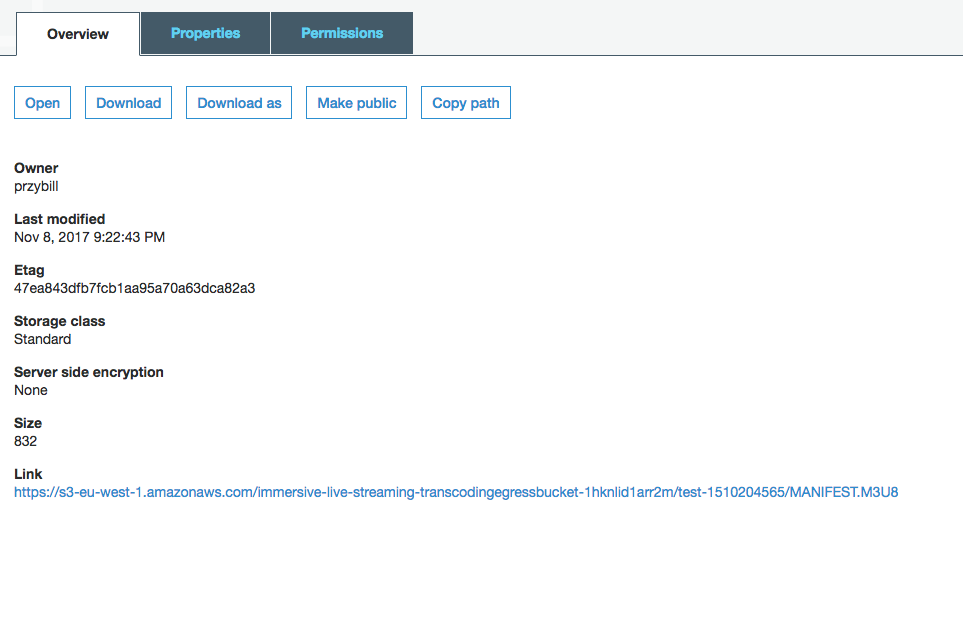

7\. To test playback, use the client from Lab 1. If you've closed the tab, the URL can be found by opening the CloudFormation console and selecting up the CloudFormation Output _**clientWebsiteUrl**_. Next, update the ?url= query parameter with the newly created m3u8 URL and confirm that the VOD asset plays for approximately the duration ffmpeg was streaming.

<pre>http://<b><i>clientWebsiteUrl</b></i>?url=https://s3-us-west-2.amazonaws.com/<b><i>transcodingEgressBucketId</b></i>/test-1508866984/MANIFEST.M3U8
</pre>

Notice that the bitrate/quality starts off low, then gets better over time? This is the ABR doing its work.

You've successfully modified the architecture to record a live stream, transcode it with EC2, and host it with an S3 bucket. Great work! With our live and VOD functional, let's make sure it stays operational during the event, no matter how many people tune in!

## Lab 3 - Caching and Content Delivery Networks

In the previous two labs, a web browser retrieved the stream. This worked well for functional play testing, but now you need to simulate many simultanious client requests and validate that the system functions for more than a few users. [Apache Jmeter](https://jmeter.apache.org/) is a Java based test framework that simulates client load at scale. The Jmeter configuration is outside of the workshop scope, but we encourage you to browse the documentation and lab.jmx file to learn more.

In addition to generating load, Jmeter can produce basic results visualization in a webpage. This will prove useful to see how caching affects server response time. This lab will focus only on response time, however, additional metrics can be gathered by implementing Real User Metrics in the player or implementing custom CloudWatch metrics for the service. Check out [Raising the Bar on Video Streaming Quality](https://www.youtube.com/watch?v=IGXrnQviFLc) for a fantastic overview of how Amazon Video addresses this common challenge.

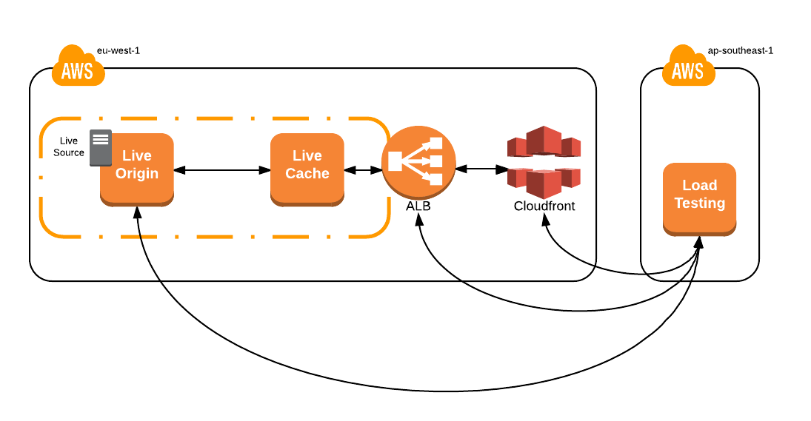

1\. To begin, deploy the following CloudFormation template. The goal is to simulate load coming from real users, so this template launches in Singapore (ap-southeast-1). If you have not already done so, you will need to create an SSH keypair for this region. Please refer to the steps in Lab 0. Make sure to specify this key while launching the stack as you did with the previous template.

[](https://console.aws.amazon.com/cloudformation/home?region=ap-southeast-1#/stacks/new?stackName=load-testing&templateURL=https://s3-eu-west-1.amazonaws.com/immersive-streaming-workshop/load.yaml)

2\. If necessary, start the test stream on the origin. You may have to SSH back into the instance or switch back to the Ireland region to retrieve the IP address.

<pre>$ ssh -i <b><i>PRIVATE_KEY.PEM</i></b> ec2-user@<b><i>primaryOriginElasticIp</b></i></pre>

<pre>
$ ffmpeg -stats -re -f lavfi -i aevalsrc="sin(400*2*PI*t)" -f lavfi -i testsrc=size=1280x720:rate=30 -vcodec libx264 -b:v 500k -c:a aac -b:a 64k -vf "format=yuv420p" -x264opts keyint=60:min-keyint=60:scenecut=-1 -f flv 'rtmp://localhost/live/test'
</pre>

3\. After the stack has completed (it will only take a few minutes), from the EC2 Console in singapore, determine the IP address of the instance deployed by the recent template, then SSH into it.

<pre>$ ssh -i <b><i>SG_PRIVATE_KEY.PEM</i></b> ec2-user@<b><i>loadTestingEC2Instance</b></i></pre>

4\. Run jmeter replacing the _-Jhost_ flag with the **_originElasticIpAddress_**. Once executed, the test will run for 3 minutes, simulating 150 clients, ramping up over a period of 15 seconds. A log of the test and an HTML webpage will be generated in the required web-hosted directory.

_Note that the HLS path /hls/test.m3u8 is hard coded into the jmx file. If you're using a different streamname than test, you must modify this to continue._

<pre>$ jmeter -n -t ~/lab.jmx -l /var/www/html/results/$(date +%H%M%S).txt -e -o /var/www/html/results/$(date +%H%M%S)/ -Jthreads=150 -Jrampup=15 -Jhost <b><i>originElasticIpAddress</b></i></pre>

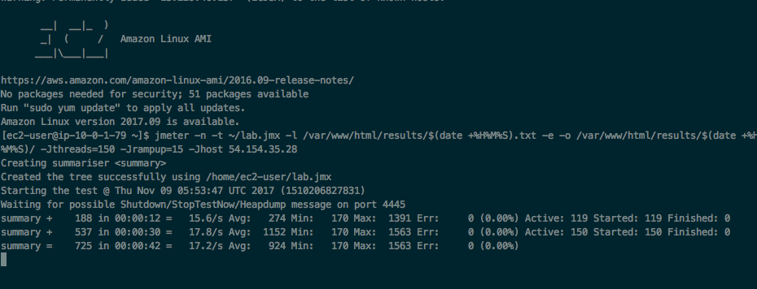

5\. In the EC2 console, back in Ireland, watch the test impact CPU in near real-time by searching 'origin', selecting the instance, then the _Monitoring_ tab. Note that FFmpeg and other process will take ~55% of CPU.

The load on the origin, omitting long-running processes and ffmpeg, is ~4%. This isn't much, but remember, you only simulated 150 clients. What if you were expecting 400,000 concurrent viewers? (Hey, who knows, maybe it's a really popular workshop!). It would be difficult to find an instance with 2000% more CPU power and costly to send the _contribution_ feed to multiple origins. Recall that this was one of the early considerations and the reason you're using a test source on the origin itself. Bandwidth can be expensive, especially from events in Las Vegas!

So, what to do? You reduce load on the origin by introducing caches.

### Edge Cache _a.k.a._ Origin Protection Cache _a.k.a_ Proxy Cache

For the purposes of live streaming a [proxy cache](https://www.wikiwand.com/en/Web_cache), when properly configured, can:

* Reduce load on the origin by orders of magnitude with caching and request coalescing
* Protect the origin(s) from unforseen CDN issues, like the [thundering herd problem](https://www.wikiwand.com/en/Thundering_herd_problem), during a large scale live event
* Scale horizontally and, with a diversified EC2 Spot Fleet request, cheaply
* Use multiple upstream origins for 1+1 redundancy
* Terminate SSL connections

By adding a cache, you divide responsibility between the origin and cache to serve the content and introduce some degree of determinism. In a perfect world, only expect one request per cache node for the same object. With deterministic load on the origin, you don't have to worry about it being crushed by unforseen load, rendering the service unavailable.

The origin converts the contribution stream into adaptive bitrate, while the cache tier serves and caches the response data for a period of time or the _Time-To-Live_ value (TTL). The TTL is set by the origin and controls downstream cache behavior. For Apple HLS, especially live, it's important to control the segment manifest TTL separately from the media segments. The segment manifest updates with every new segment made available by the origin and, if it's cached too long, could cause client issues.

The configuration file on the origin, located in /etc/nginx/default.d/rtmp.conf or [here](start/origin/nginx/default.d/rtmp.conf) in this repository show the TTL parameters for the different objects.

To keep costs at a minimum, this workshop defaults to a single instance, but you can easily implement an autoscaling group to dynamically scale this tier to meet large demand spikes. 

Let's test this tier to see how it changes the performance characteristics of the system.

1\. SSH into the load testing instance if you haven't already done so.

<pre>$ ssh -i <b><i>SG_PRIVATE_KEY.PEM</i></b> ec2-user@<b><i>loadTestingEC2Instance</b></i></pre>

2\. Run the same Jmeter load test, this time updating the -Jhost flag to point to the DNS of the Application Load Balancer that's handling requests for the cache fleet, called _**applicationLoadBalancerDns**_ in the Ireland CloudFormation Outputs.

<pre>$ jmeter -n -t ~/lab.jmx -l /var/www/html/results/$(date +%H%M%S).txt -e -o /var/www/html/results/$(date +%H%M%S)/ -Jthreads=150 -Jrampup=15 -Jhost <b><i>applicationLoadBalancerDns</b></i></pre>

3\. In the EC2 console, watch the load test impact origin CPU in near real-time by selecting the instance, then the _Monitoring_ tab. The origin load is negligible compared to the 4% from the origin load test, success!

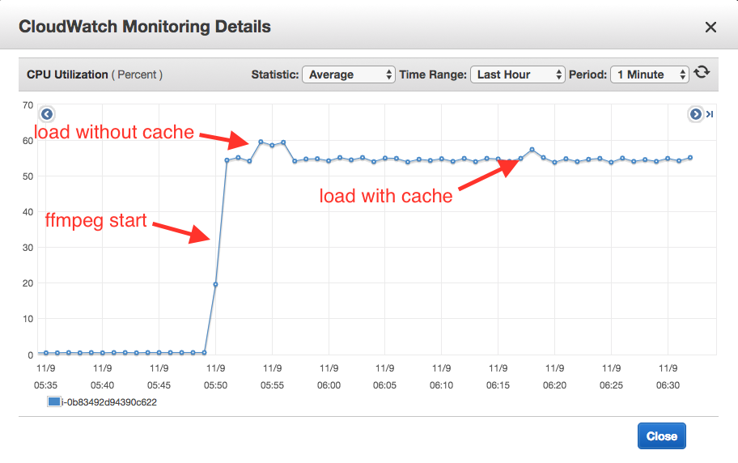

4\. When Jmeter is complete, access the results hosted on the load test instance in Singapore via a web browser. Click on the directory named _HHMMSS_ timestamp associated with the jmeter test and review the results.

<pre>http://<b><i>loadTestingEC2Instance</b></i>/results/</pre>

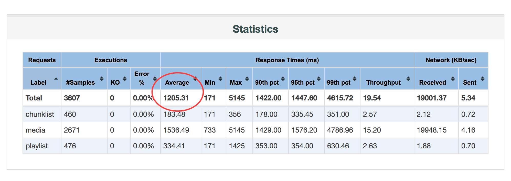

The response time metric is likely quite high from Singapore to Ireland, but will vary. re:Invent is a global conference for attendees all over the world, how can you improve service response time performance for any viewer, no matter the location?

### Content Delivery Network

Introducing a [Content Delivery Network](https://www.wikiwand.com/en/Content_delivery_network) (CDN) is another common strategy to improve client performance while further decreasing load on the service components (origin, cache). We have not configured the CDN as part of this lab, so you need to configure CloudFront before testing.

1\. Open the CloudFront console, click Create Distribution, then Get Started under the Web heading.

2\. Configure the Distribution by populating the Origin Domain Name field with the _**applicationLoadBalancerDns**_. The default configuration is sufficient for this workshop, scroll to the bottom of the page and click _Create Distribution_. It will take ~10 minutes for CloudFront to move from 'In Progress' to 'Deployed.' Take this time to review the CloudFormation templates and configuration files contained in this workshop.

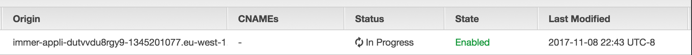

With this configuration, initial client requests to CloudFront and cache misses will be fulfilled from the **_edgeCacheSpotFleet_**. If **_edgeCacheSpotFleet_** also cache misses, requests will finally be fulfilled by the origin.

3\. Now you're ready to test. SSH into the load testing instance

<pre>$ ssh -i <b><i>SG_PRIVATE_KEY.PEM</i></b> ec2-user@<b><i>loadTestingEC2Instance</b></i></pre>

4\. Update the _-Jhost_ flag to point to the Domain of the CloudFront Distribution, found in the CloudFront console under Domain Name.

<pre>$ jmeter -n -t ~/lab.jmx -l /var/www/html/results/$(date +%H%M%S).txt -e -o /var/www/html/results/$(date +%H%M%S)/ -Jthreads=150 -Jrampup=15 -Jhost <b><i>CloudFrontDistributionDns</b></i></pre>

5\. When Jmeter is complete, access the results via a web browser.  Click on the directory named _HHMMSS_ timestamp associated with the jmeter test and review the results. Compare the response time metrics against the previous test.

<pre>http://<b><i>loadTestingEC2Instance</b></i>/results/</pre>

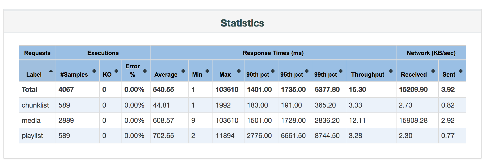

Adding a CDN improved client response time by ~50%! The viewers will definitely appreciate the performance enhancements and the compute costs to serve all of them have decreased significantly. Win, win!

## Conclusion

We hope you enjoyed the workshop and are inspired to incorporate these learnings into your own video streaming projects. Please submit any questions or issues to the github repo and we'll do our best to answer.

## To Try or Build

Here's a few extra things to try if you still have time left over during the workshop:

* Try using your own camera and RTMP capable encoder to contribute a source to the origin (beware bandwidth requirements)
* Try deploying the reference architecture in the parent directory of this README. This uses two origin systems and can support 1+1 fail over should problem occur over a network path or origin instance
* Try adjusting the fleet target size, creating a few VOD recordings, and watching the _**transcodingSpotFleet**_ scale up
* Try creating a CloudFront Distribution for the VOD bucket and web client

Please submit pull requests to this workshop or associated parent reference architecture. We're happy to help you get started with any of these items:

* Implement a SNS email notification to notify an administrator when a recording has completed processing
* Decrease overall live latency by tuning the HLS segment sizes
* Implement cubemap filter in VOD processing fleet to compare against live spherical projection
* Implement OAI so that only CloudFront can access the origin/cache fleet
* Implement CI/CD testing with CodePipeline to automate stack updates

### Cleanup and Disclaimer

When you're done with the workshop, follow these steps to make sure everything is cleaned up. Remember, you used two CloudFormation templates in two separate regions - Ireland and Singapore.

* Delete any manually created resources throughout the labs.
* Delete any files stored on S3.
* Delete both CloudFormation stacks launched throughout the workshop.

## Appendix

## I got stuck somewhere in the labs, what do I do?

Launch complete.yaml and start from the beginning of any lab.

## Additional Resources and References

[Encoding techniques for 360-degree video](https://code.facebook.com/posts/1126354007399553/next-generation-video-encoding-techniques-for-360-video-and-vr/)

[FFmpeg cubemap filter](https://github.com/facebook/transform360)

[Nginx-RTMP module](https://github.com/arut/nginx-rtmp-module)
