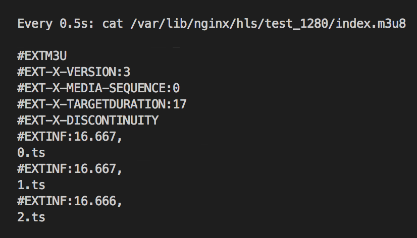

# W.I.P 360-degree live streaming on AWS

## Overview

360-degree video allows content creators to capture and deliver unique experiences. Social Media sites have implemented 360-degree videos into their sites, making the technology simple to access, but what of those who attempt to build our own unique experiences, where do they begin? Additionally, live streaming, a commodotized consumer product spanning far outside the realm of Social Media, still poses unique implementation challenges. Afterall, what happens in real-time never occurs again, therefore, any issue could bring heartache to viewers.

The goal, with this workshop, is to combine these two technologies into a single solution. Demystifying live streaming, while combining the unique experience of immersive video.

### Requirements

* AWS account - if you don't have one, it's easy and free to create one
* AWS IAM account with elevated privileges allowing you to interact with CloudFormation, IAM, EC2, ECS, S3, Cloudwatch, and Cloudfront
* A workstation or laptop with an ssh client installed, such as putty on Windows or terminal or iterm on Mac
* Familiarity with Bash, HTTP, web servers, and basic video processing

### Labs

The labs in this directory are designed to be completed in sequential order. If you're attending an AWS event, your host will give you an overview of the technology and expectations for each lab. If you're following along at home, we've provided the presentation materials as a pdf. Feel free to open issue tickets on the repo if you have questions or issues.

**Lab 1:** Simple Live Streaming Service

**Lab 2:** Video-on-Demand Recording

**Lab 3:** Caching and Content Delivery

### Conventions

Throughout this README, we provide commands for you to run in the terminal.  These commands will look like this: 

<pre>
$ ssh -i <b><i>PRIVATE_KEY.PEM</i></b> ec2-user@<b><i>primaryOriginIP</i></b>
</pre>

The command starts after $.  Words that are ***UPPER_ITALIC_BOLD*** indicate a value that is unique to your environment.  For example, the ***PRIVATE\_KEY.PEM*** refers to the private key of an SSH key pair that you've created, and the camelCase ***primaryOriginIP*** is a value provided by a Cloudformation Output or Resource.


### Cleanup and Disclaimer


## Challenge

Imagine that you're part of the Re:Invent `17 team, there's limited availablity to sessions and not everyone can attend in person - what could you do? As the organizer, you could stream the sessions in regular old fixed/flat view with a narrow field-of-vision **_or_** you could "raise the bar" on conference streaming an immersive experience. Your challenge, should you choose to accept it, is to build such a system by following this workshop.

{marketechture}

## Lab 0 - Setup

1\. First, you'll need to select a [region](http://docs.aws.amazon.com/AWSEC2/latest/UserGuide/using-regions-availability-zones.html). For this lab, you need to choose either **Ohio** or **Oregon**. At the top right hand corner of the AWS Console, you'll see a **Support** dropdown. To the left of that is the region selection dropdown.

2\. Next, you need to create an SSH key pair which is used to login to the instances once provisioned.  Go to the EC2 Dashboard and click on **Key Pairs** in the left menu under Network & Security.  Click **Create Key Pair**, provide a name (can be anything, make it something memorable) when prompted, and click **Create**.  Once created, the private key in the form of .pem file will be automatically downloaded.  

If you're using linux or mac, change the permissions of the .pem file to be less open.  

<pre>$ chmod 400 <b><i>PRIVATE_KEY.PEM</i></b></pre>

If you're on windows you'll need to convert the .pem file to .ppk to work with putty.  Here is a link to instructions for the file conversion - [Connecting to Your Linux Instance from Windows Using PuTTY](http://docs.aws.amazon.com/AWSEC2/latest/UserGuide/putty.html)

3\. For your convenience, we provide a CloudFormation template to stand up the core infrastructure.

{architecture diagram}

*Prior to launching a stack, be aware that a few of the resources launched need to be manually deleted when the workshop is over. When finished working, please review the "Workshop Cleanup" section to learn what manual teardown is required by you.*

Click on one of these CloudFormation templates that matches the region you created your keypair in to launch your stack:  

Region | Launch Template
------------ | -------------  
**Ohio** (us-east-2) | [](https://console.aws.amazon.com/cloudformation/home?region=us-east-2#/stacks/new?stackName=ecs-deep-learning-stack&templateURL=https://s3.amazonaws.com/ecs-dl-workshop-us-east-2/ecs-deep-learning-workshop.yaml)  
**Oregon** (us-west-2) | [](https://console.aws.amazon.com/cloudformation/home?region=us-west-2#/stacks/new?stackName=ecs-deep-learning-stack&templateURL=https://s3.amazonaws.com/ecs-dl-workshop-us-west-2/ecs-deep-learning-workshop.yaml)  

The template will automatically bring you to the CloudFormation Dashboard and start the stack creation process in the specified region. Click "Next" on the page it brings you to. Do not change anything on the first screen.


The template sets up a VPC, IAM roles, S3 bucket, SQS, and EC2 Instances running various components of the solution - origin, cache, and transcode.  The idea is to provide a contained environment, so as not to interfere with any other provisioned resources in your account.  In order to demonstrate cost optimization strategies, the EC2 Instance is an [EC2 Spot Instance](https://aws.amazon.com/ec2/spot/) deployed by [Spot Fleet](http://docs.aws.amazon.com/AWSEC2/latest/UserGuide/spot-fleet.html).  If you are new to [CloudFormation](https://aws.amazon.com/cloudformation/), take the opportunity to review the [template](https://github.com/awslabs/immersive-media-refarch/blob/master/workshop/start.yaml) during stack creation.

**IMPORTANT**  
*On the parameter selection page of launching your CloudFormation stack, make sure to choose the key pair that you created in step 1. If you don't see a key pair to select, check your region and try again.*


**Create the stack**  
After you've selected your ssh key pair, click **Next**. On the **Options** page, accept all defaults- you don't need to make any changes. Click **Next**. On the **Review** page, under **Capabilities** check the box next to **"I acknowledge that AWS CloudFormation might create IAM resources."** and click **Create**. Your CloudFormation stack is now being created.

**Checkpoint**  
Periodically check on the stack creation process in the CloudFormation Dashboard.  Your stack should show status **CREATE\_COMPLETE** in roughly 5-10 minutes.  In the Outputs tab, take note of the **primaryOriginElasticIp** and **clientWebsiteUrl** values; you will need these in the following labs.     


Note that when your stack moves to a **CREATE\_COMPLETE** status, you won't necessarily see EC2 instances yet. If you don't, go to the EC2 console and click on **Spot Requests**. There you will see the pending or fulfilled spot requests. Once they are fulfilled, you will see your EC2 instances within the EC2 console.

If there was an error during the stack creation process, CloudFormation will rollback and terminate.  You can investigate and troubleshoot by looking in the Events tab.  Any errors encountered during stack creation will appear in the event log. 

## Lab 1 - Simple Streaming Service

In this lab, you will live stream to the origin and confirm that it plays back with a test client, but first, a word on sending live sources to remote infrastructure.

In the real-world, content is captured in real-time via a camera, compressed, and sent to a central location for further processing and distribution. Streaming from a remote production location to distribution infrastructure is called *Contribution* and it requires careful consideration of the data rate and network charactaristics.

- Will the remote location have dedicated bandwidth or only public internet connectivity?
- What data rate is required to create a quality end-user experience?
- Redundant contribution streams over multiple network paths?
- Do users have latency expectations?
- Which protocol is most appropriate? HLS/RTMP/RTP?

To ensure that these factors don't hinder the workshop, you'll use a test source to simulate a real-time live stream. This allows you to test the infrastructure with a live source local to the region in which it is deployed, avoiding first-mile connectivity challenges. Use this source for the majority of the lab, but don't forget to connect your own devices if bandwidth is available. There's a list of cameras we've tested in the appendix. However, proceed with caution when using a mobile camera, as they will not warn you when streaming over wifi vs cellular networks. AWS **_IS NOT_** liable for data charges incurred as a part of this workshop.

1\. From the Cloudformation console, select the stack you created, then Outputs. Find _**primaryOriginElasticIp**_ and note the value. This is the IP address of our media origin. SSH into this instance with the following command:

<pre>$ ssh -i <b><i>PRIVATE_KEY.PEM</i></b> ec2-user@<b><i>primaryOriginElasticIp</b></i></pre>

2\. Next, start ffmpeg to simulate a real-time source. Run the following command, which uses a lavfi virtual device input for ffmpeg in conjuntion with libavfilter to generate a test pattern.

_Note, use of a terminal multiplexer like screen or tmux is advised to avoid having to open multiple SSH connections while ffmpeg is running_

<pre>
$ ffmpeg -stats -re -f lavfi -i aevalsrc="sin(400*2*PI*t)" -f lavfi -i testsrc=size=1280x720:rate=30 -vcodec libx264 -b:v 500k -c:a aac -b:a 160k -vf "format=yuv420p" -f flv 'rtmp://localhost/live/test'
</pre>

3\. With the test stream is running and connected, new HLS segments are constantly generated and unused segments cleaned-up by the nginx-rtmp module. Confirm that this is the case by listing the directory contents periodically or watching the manifest file.

<pre>$ sudo watch -n 0.5 cat /var/lib/nginx/hls/test_1280/index.m3u8</pre>



4\. Now for the exciting part - _playing_ the "live" stream. Within the CloudFormation console, find the Output listed as _**clientWebsiteUrl**_. This is a static website, built with [A-Frame](https://aframe.io/) and [HLS.js](https://github.com/video-dev/hls.js/), hosted in an S3 bucket. Please use a modern verion of the Google Chrome browser.

 Copy or open in a new browser tab, but note that playback requires you to provide a value to the _url_ query string parameter. View the running stream from the origin by combining the _**primaryOriginElasticIp**_ with the application (hls) and stream name (test), similar to the URL example below:

<pre>http://<b>YOUR_TRANSCODINGEGRESS_BUCKET</b>.s3-website-REGION.amazonaws.com/?url=http://<b>primaryOriginElasticIp</b>/hls/test.m3u8</pre>

You should now see spherical colorbars and hear a test tone from the system. Success!

{picture of colorbars}


## Lab 2 - Video on Demand

What about participants who aren't able to attend during the scheduled session? You should provide Video-on-Demand to allow anyone to virtually attend when they chose.

### Config Changes

Thankfully, the nginx-rtmp record directive that works much like a VCR. You'll use this to capture the live source and then transcode the recording with a fleet of EC2 instances. Simple Queue Service (SQS) decouples the transcode requests, or jobs, from the transcode fleet. Allowing the fleet to autoscale based on number of recordings waiting to be processed. 

With the VOD transcode fleet, jobs can run much slower than real-time, emphasizing quality over real-time delivery. Additionally, if we want to create additional ABR renditions or apply alternate projection mapping filters, you'll need a file-based transcoder.

{diagram}

1\. SSH into the Origin

<pre>$ ssh -i <b><i>PRIVATE_KEY.PEM</i></b> ec2-user@<b><i>primaryOriginElasticIp</b></i></pre>

2\. Modify the nginx configuration to include the record directive. This records all audio/video streams to /var/lib/nginx/rec, rolls over the file when the size reaches 128M, and, upon recording creation, executes a script to upload the asset into S3. A full listing and description of the nginx-rtmp directives can be found [here](https://github.com/arut/nginx-rtmp-module/wiki/Directives).

<pre>$ sudo nano /etc/nginx/rtmp.d/rtmp.conf</pre>

```
   ...
      # put record directive configuration here
      record all;
      record_path /var/lib/nginx/rec;
      record_max_size 128000K;
      exec_record_done /usr/local/bin/record-postprocess.sh $path $basename;
   ...
```

3\. Restart nginx for the changes to take effect.

<pre>$ sudo service nginx restart</pre>

### VOD Test

Recording begins when a stream is published to the nginx application. Upon stream stop, nginx-rtmp completes recording and executes a script, uploading the file to **_s3IngressBucket_**. New objects in this bucket generate an event, which is published to _**transcodingQueue**_. _**transcodingSpotFleet**_ periodically polls this queue and transcodes the recording. Resulting ABR outputs are uploaded into the same bucket hosting our client, **_s3EgressBucket_**.

With the configuration updates in place, you can now test the full system functionality. There's a few components to the VOD system, so you'll want to examine each one to validate proper execution. 

1\. Start the ffmpeg test stream

<pre>
$ ffmpeg -stats -re -f lavfi -i aevalsrc="sin(400*2*PI*t)" -f lavfi -i testsrc=size=1280x720:rate=30 -vcodec libx264 -b:v 500k -c:a aac -b:a 160k -vf "format=yuv420p" -f flv 'rtmp://localhost/live/test'
</pre>

2\. Open the SQS console, select the queue containing _**-transcodingQueue**_, select _Queue Actions_ from the menu and then _View Messages_. Finally, to view messages as they appear, click the blue _Start Polling for Messages_ button

{image example}

3\. Back in the terminal window, stop the ffmpeg test source

<pre>$ ctrl+c # push these simultaniously</pre>

4\. Confirm message has been generated in the queue


The transcode worker is running a polling script every 5 seconds to pull down any new job from SQS. By now, it should be processing a job. We can confirm this by looking at the CPU utilization, viewing the notification in the Cloudwatch Log Stream, or by simply waiting for the output to appear in the S3 bucket noted as _**transcodingEgressBucketId**_ in the Cloudformation Outputs.

5\. In the EC2 console, search for 'transcoding', this will filter for the EC2 instance we have deployed that has the _transcodingSecurityGroup_ attached. Select the resulting instance and, at the bottom of the console, select the _Monitoring_ tab. Here, we should see a sharp incline in the CPU utilization while the instance is processing.

{cpu incline example}

6\. When the CPU metric goes down, our VOD transcode is complete. Navigate to the S3 console and search/select the bucket containing _**transcodingEgress**_. Here, you should see a key starting with test-_TIMESTAMP/_, this is the output directory of the transcode job. Within, there should be many .TS objects and a MANIFEST.m3u8 object. Select the MANIFEST.m3u8 and note the link, this is our playback URL for the VOD output.

### VOD Playback

To test playback, use the client from Lab 1. If you've closed the tab, the URL can be found by opening the Cloudformation console and selecting up the Cloudformation Output _**clientWebsiteUrl**_.

Next, update the ?url= query parameter with the newly created m3u8 URL and confirm that the VOD asset plays for approximately the duration of our test. 

<pre>http://_**transcodingEgressBucketId**_?url=https://s3-us-west-2.amazonaws.com/labz-transcodingegressbucket-17kb7fa5igln5/test-1508866984/MANIFEST.M3U8
</pre>

You've successfully modified the architecture to record the live stream, transcode it with EC2, and distribute it with an S3 bucket. Great work! With our live stream and VOD recording functional, let's turn to scalability.


## Lab 3 - CDN and Caching

### Generating Load

In the previous two labs, you used a web browser to play the stream. This worked well for functional testing, but now you need to simulate many simultanious client requests to ensure the system scales properly. [Apache Jmeter](https://jmeter.apache.org/) is a Java based test framework that simulates client load at scale. The details of the Jmeter configuration are outside the scope of this workshop, but we'd encourage you to browse the documentation to understand the terminology.

In the real-world, load testing is typically part of a development/test pipeline, possibly even automated with services like Codepipeline and Codedeploy. For educational purposes, Jmeter will run on one of the _**transcodingSpotFleet**_ instances. Jmeter has already been installed and the required .jmx configuration is located in /home/ec2-user/.

In addition to generating load, Jmeter can produce basic results visualization. This will prove useful in comparing the performance of each tier.

{architecture diagram}

### Origin

1\. SSH into one of the transcoding EC2 instances. You can find this by searching 'transocding' in the EC2 console.

<pre>$ ssh -i <b><i>PRIVATE_KEY.PEM</i></b> ec2-user@<b><i>transcodingInstance</b></i></pre>


2\. Run jmeter replacing the -Jhost flag with the **_originElasticIpAddress_**. This test will run for 3 minutes, simulating 50 clients, ramping up over a period of 15 seconds. A log of the test will be stored in results.txt and an HTML webpage will be generated in origin/

(maybe we can put this page somewhere hosted by nginx????)

<pre>$ ./jmeter -n -t ~/lab.jmx -l origin.txt -e -o origin/ -Jhost <b><i>originElasticIpAddress</b></i> -Jthreads=50 -Jrampup=15 -Jduration</pre>

3\. In the EC2 console, you can watch the load test impact CPU in near real-time by selecting the instance, then the _Monitoring_ tab.

4\. By placing results in the /results/ directory with the Jmeter CLI, we can now access them via a web browser. After Jmeter has completed, simply point a browser to the instance.

<pre>http://<b><i>transcodingInstanceIp</b></i>/results/origin/</pre> 

5\. Note the average latency, percentiles, etc. and keep this tab open. We'll be comparing this information later.


### Cache

but a cache within our infrastructure can also reduce origin load, while protecting the all-important origin from unforseen CDN issues or the [thundering herd problem](https://www.wikiwand.com/en/Thundering_herd_problem) during a big live event.


<pre>$ ./jmeter -n -t ~/lab.jmx -l cache.txt -e -o cache/ -Jhost <b><i>originElasticIpAddress</b></i> -Jthreads=50 -Jrampup=15 -Jduration</pre>

### Content Delivery Network

Introducing a Content Delivery Network (CDN) is a common strategy to improve client performance while lowering the overall load on your backend origin.


1. deploy lab3 cfn template creating a cache tier and application load balancer in front of it
2. Create a new Cloudfront distribution
3. Configure our origin (ALB)
4. Use test client to play back the stream, now with Cloudfront URL
use cURL to confirm caching

<pre>$ ./jmeter -n -t ~/lab.jmx -l cdn.txt -e -o cdn/ -Jhost <b><i>originElasticIpAddress</b></i> -Jthreads=50 -Jrampup=15 -Jduration</pre>

## Extra Credit

* Use your own camera and RTMP capable encoder to contribute a source to the origin (beware bandwidth requirements)
* Decrease overall live latency by tuning the segment sizes
* Implement cubemap filter in VOD processing fleet to compare against live spherical projection
* Use spot fleet for VOD processing fleet
* Implement OAI so that only cloudfront can access the origin/cache fleet
* SNS notification on VOD processing complete egress bucket


## Appendix
## Additional Resources and References
### Live Streaming Basics

### 360 Video Basics

### 360 Cameras

Ricoh Theta
insta360 one
insta360 ?

Bandwidth optimization and Quality
Adaptive Focus
HEVClive production, multi-camera, switching/editing (vremiere

https://code.facebook.com/posts/1126354007399553/next-generation-video-encoding-techniques-for-360-video-and-vr/
http://web.cecs.pdx.edu/~fliu/project/vremiere/

https://github.com/facebook/transform360 – ffmpeg cubemap
https://github.com/arut/nginx-rtmp-module – nginx rtmp


